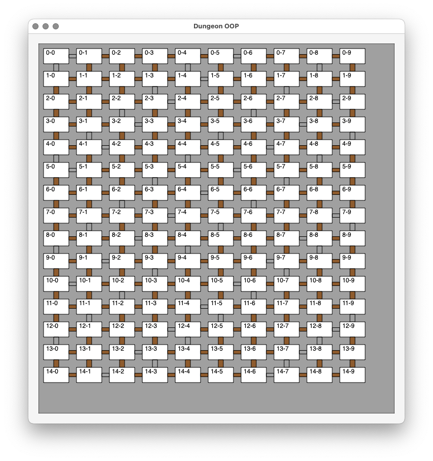

# Dungeon

Take the Normalizing example from Chapter 2 and try it OOPstyles
and DoDstyles.

Also to further confuse things, use Swift, and see if we can
figure out cache behavior between the two.

Idea is to take the dungeon, put stuff in it, draw it, maybe move
around it doing things, and see how easy/hard it is in the two
paradims, and also if we can infer anything with the differences
in data access patterns

# Screenshot gallery

Some screenies from development. First step was to just get stuff
on the screen.

### It works!

Got basic room and door classes in, and things populated enough to
draw. (even though door drawing assumes kind of rectilinear layout)

