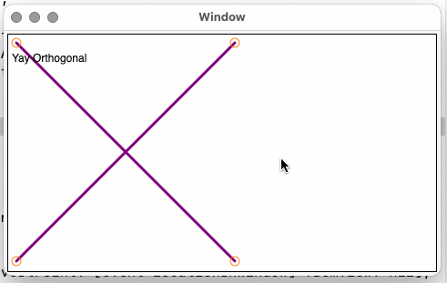
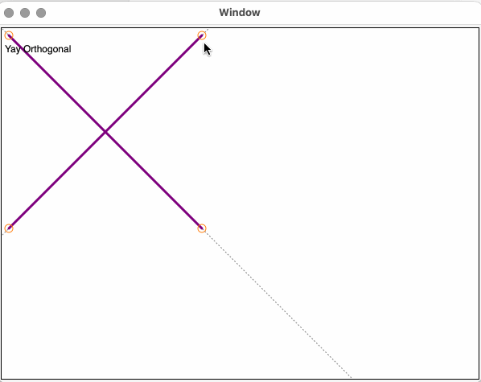
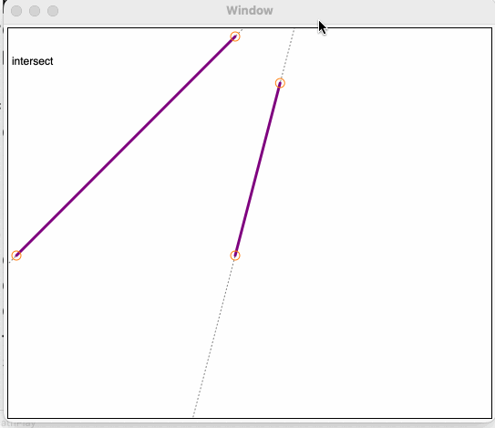

# Game Maths

Some playing around with formulas and code adapted from _Beginning Math
and Physics for Game Programmers" by Wendy Stahler.

(I'm reading it on the ~Safari~ O'Reilly learnage platform.

### Lines

It starts off with simple line maths, including things like slope
and checking for perpendicularity / orthogonality by looking at
the lines.  Added a small appkit program that uses those calculations
to see if two lines you're dragging around are orthogonal (ignoring the
vertical case because I'm lazy)

And here with projecting the line past the endpoints

Showing line relationships (intersect / parallel / overlapping)

