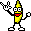

## \m/ METAL \m/ 

Looking at Apple's Metal, because I don't have enough pain in my life.

* Apple site: https://developer.apple.com/metal/ - "a low-overhead
  API, rich shading language, tight integration between graphics and
  compute, and an unparalleled suite of GPU profiling and debugging
  tools."
* feature set tables - https://developer.apple.com/metal/Metal-Feature-Set-Tables.pdf

--------------------------------------------------

# Metal Programming Guide

RedQueenCoder's book!  Using it as a friendly intro to all the things.
https://www.amazon.com/Metal-Programming-Guide-Tutorial-Reference/dp/0134668944

* All of apple's chips that support metal are unified, so no memory copying
  overhead between CPU and GPU
* Command Buffer: central control object, giving control on how and when
  render bffers are executed.  Exposes the complexity in exchanged for control
  and performance.
* Precompiled Shaders: moving shader compilation to build time.
* Prevalidated State: avoids polling an API (like OpenGL ES) for moving into
  an invalid state.
* Metal follows the law of Conservation of Data - it doesn't create or
  destroy, merely modifies it.  So it needs to be fed. Cocoa has the Model I/O
  framework provides an easy way to bring vertex data from 3D modeling
  programs.  Use it to do the heavy lifting of parsing data files and loading
  vertex buffers.
* Representing the GPU:
  - the GPU via `MTLDevice` for creating and managing persistent and transient
    objects used to process data and render to the screen.
    - there's a single call to create a default system device, which is the
      only way the GPU can be represented in software
  - The device lets you create *command queues*.  They hold *command buffers*,
    and the buffers contain encoders that attach commands to the GPU
  - command buffers store the instructions necessary to render a frame. e.g.
    - Set state (how drawing is done)
    - draw calls (doing the actual work of rendering)
    - these are transient objects that are single use
    - the buffer is deallocated when the work is done
  - each command is encoded in the enqueing order in the buffer
  - command _queues_ are expensive to create, so are reused
* Render state Configuration
  - conceptualize the work done by Metal as a series of transformations
    that are linked together in a rendering pipeline
    - data preparation for the GPU
    - vertex processing
    - primitive assembly
    - fragment shading
    - raster output
  - Vertex Fetch -> Vertex Shader -> Tessellation Control Shader -> Tessellation -> Tessellation Evaluation Shader -> Rasterization -> Fragment Shader -> Framebuffer Operations
  - a guiding principle is to move the CPU-expensive work to the beginning
    of the render process (such as state validation)
  - Uses `MTLRenderPipelineState` protocol, contains a collection of state that
    can be quickly set on a render command encoder, avoiding calling
    a ton of state-setting calls.
  - `MTLRenderPipelineDescriptor` has properties to configure how pipeline
    state objects are created
    - sets up a prevalidated state.
  - state that can be prevalidated includes
    - specifying shader functions
    - attaching color / depth / stencil data
    - raster and visiblity state
    - tessellation state
  - can then be passed to the command encoder.
* Preparing Data for the GPU
  - most assets that wll be used in 3D Metal will come from Blender or Maya
  - they create formatted files that contain vertex information describing
    whatever model you are trying to create
  - describe the position and color of each vertex in the shape, describes
    how those vertices are connected to generate meshes that create 
    the apperance of a 3D model
  - brought into the program as a array values
    - if format is supported by ModelIO, can import using it
    - or manually enter all the vertex data into the app
  - Four ways to encode data for the command buffer:
    - `MTLRenderCommandEncoder`
    - `MTLComputerCommandEncoder`
    - `MTLBlitCommandEncoder`
    - `MTLParallelRenderCommandEncoder`
  - the choice of the encoder depends on what kind of work you want from 
    the GPU 
    - right now focus on the graphics side of thing, so
      `MTLRenderCommandEncoder`
    - the render encoder prepares data sources for the vertex and fragment
      shaders, done in the form of buffers
* Shaders
  - to perform rendering, need to create vertex and fragment shaders
  - two parts of the same program
  - the vertex shader calculates the position of each vertex, and whether
    the vertex is visible in the frame.
    - it get positional data, but can get other stuff like texture coordinates.
    - receive either per vertex or per object primitive
    - object primitives are used in "instanced draing"
  - the fragment shader fills primitives with colors
    - usually based on the textures and (simplified) light physics
  - Graphics functions have an argument list that enumerates the resources
    they operate on
    - bound to buffer and texture objects via an _argument table_
    - the arguments are passed into the shader, so when writing your shader
      code, your passed-in arguments must correlate to arguments in the
      argument table.
  - vertex shaders receive data that's been prepared for the GPU
    - set up in a st ream that is steadily fed to the shader program,
      processed one at a time.
  - the shader program then processes that and passes it along to be assembled
    into primitives.
  - vertex shadder called for every single vertex referenced in a draw call
    - so optimize by reducing the number of vertices
  - Shaders written in Metal Shading Language (MSL) - subset of C++14
    - includes some standard data types (ints and floats), and some
      specialized types and functions, like dt
  - Metal has a number of build-in classes to determine how vertex data
    is stored and mapped to arguments
* Clipping
  - There are two conceptual worlds
    - world space
    - camera space
  - (objects on/off screen, or partially)
  - if a primitive is not present at all, it's culled
    - including face of a vertex that's not facing the camera
  - if it's partially visible, the primitive gets clipped
    - a triangle is modified to a polygon (which is then broken into
      triangles again) so that it abuts the clipping rectangle
* Primitive Assembly
  - after the vertex shader is done processing the vertex data, needs to be
    assembled into primitives
    - points
    - lines
    - triangles
  - in your draw call, you tell teh GPU what type of primitive you want to
    draw
  - these shapes are translated into a series of pixels that need to be
    colored and output to the screen. these are then rasterized
* Rasterization
  - modeling how images appear on a screen.
  - involves more than shapes and primitives, also with modeling how light
    is scattered and how it interacts with the objects
  - traditionally there's two ways of doing this
    - ray tracing
    - rasterization
  - Ray tracing
    - scans each pixel in the frame until it intersects with something.
      The color of whatever the ray intersects is the color of that pixel
    - primitives behind other objects won't be rendered. THe ray will stop
      and return a color before it can reach the obstructed object
  - Rasterization
    - projects the primitives to the screen, then loops over the pixels
      and chesk to see if an object is present in the pixel. If so,
      it's filled with the object's color
* Fragment Shading
  - the fragment shader is responsible for determing the color of every
    pixel in the frame (r+g+b+a)
  - if there are no lighting or filters or other effects applied, then
    the fragment shader is a pass-through
  - if want lighting or other effects, the fragment shader calculates that.
    - e.g. light on a tennis ball, calcualtes distance to the light to
      figure out the light's influence on the ball's inherant color
  - same with texture mapping
  - the last stop before frame-bufferville
* Raster Output
  - before going to the screen, the output goes through the frame buffer
  - (double-buffering)

### Hello Triangle

like hello world, but draws a triangle. (nice!)

This chapter builds the app without a template. 

* metal uses a normalized coordinate system
  - two units by two units by one
  - the phone screen is one unit by one unit size
  - so upper left of the screen is 1,1,1, and lower right is -1, -1, 0
    - center is 0, 0, 0.5
  - used no matter the aspect ratio of the screen
    - rectangular on phong, square for wartch
  - https://developer.apple.com/documentation/metal/resource_fundamentals/setting_resource_storage_modes
* Three types of `MTLFunction`
  - vertex
  - fragment
  - kernel
  - collected into `MTLLibary` objects
    - can be compiled from strings at runtime, or buildtime
* command buffer needs to encode render commands in order to know what
  work to send to the GPU

