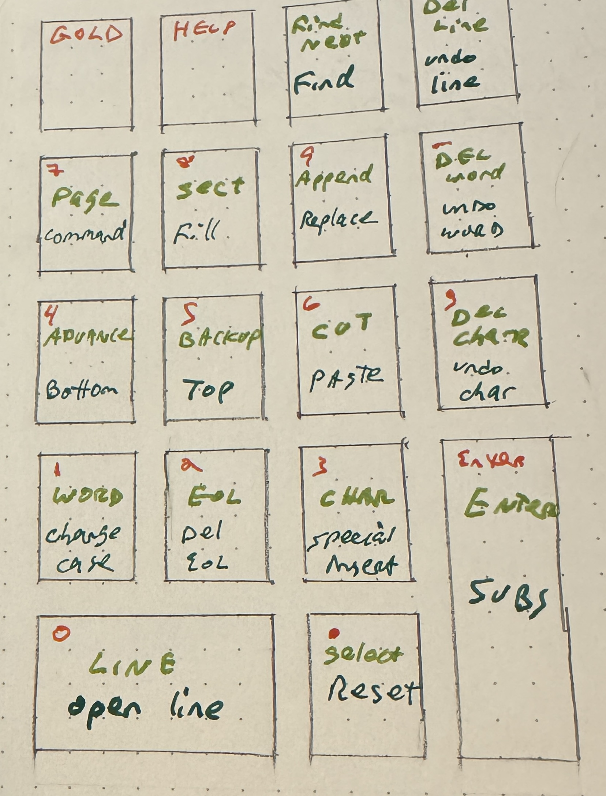

# VMS Notes

## LSSM-peculiar notes

Terminals are connected to a terminal server.

show services:

```
> SHOW SERV
```

The MicroVAX I've been using is called SPXG.  Connect to it like

```
> CONNECT SPXG
```


## Random DCL deets

Then should get the (open)VMS prompt to lob-in.

`^U` clear typing if you've messed up a command at the DCL prompt

full file specification is network node, device, directory, filename, type, and version

File names are up to 9 characters.

`oop.dat;32`  <- file oop, type dat, 32nd version

`$ PURGE` to get rid of all but the latest file version

## FTP

Get files on to and off of the lappy via FTP.

You have to be on the LSSM internal network.

On the mac, I'm running [QuickFTP](https://apps.apple.com/au/app/quickftp-server/id1451646819?mt=12) from the app store.  Pretty trivial to set up.  Fire that up and make note of the IP
address it's listening on (say 192.168.0.211)

Then on the VMS side:

```
$ FTP
FTP> PORT 2121
FTP> CONNECT 192.168.0.211
FTP> LOGIN markd password
FTP> PUT BLAH.MAR BLAH.MAR
-or in bulk-
FTP> MPUT *.MAR
```

On the mac side the come through with the executable bit set, so you'll want to
`chmod -x *` the files you brought over.

Default file specification is `DISK$USER:[markd]`

Go up a directory with `SET DEFAULT [-]`

go into a subdirectory, need to specify the path to it

```
$ SET DEFAULT [markd.assembly]
```

`^A` toggles between insert and overstrike mode at the DCL command-line

`SEARCH filenames string` is like grep, but the arguments are reversed

Redirect to a file with something like 

```
$ SHOW LOGICAL/OUTPUT=LOG.TXT /ALL
```


## BUILDING WITHOUT BUILD TOOLS

Still need to see if there's make-like object. There is talk of MMS (Module Management
System), but I'm not sure if that's installed (there is no MMS command on the microVAX
I'm currently using)

For the Sara Baase book, there are some macros and a little library that need to be used.

Build those with

```
$ LIBRARY/CREATE/MACRO IOMAC.MLB IOMAC.MAR
$ MACRO IOMOD+IOMAC/LIB
```

Then to build a single-file VAX MACRO program with the library

```
$ MACRO/DEBUG FILE.MAR+IOMAC/LIB  -- makes FILE.OBJ, with debugger support
$ LINK FILE.OBJ,IOMOD             -- makes FILE.EXE. The .OBJ is optional
$ RUN FILE                        -- runs FILE.EXE
```

## EDT

EDT editor (oooold school, comes from PDP-11 IIRC). There are newer editors (EVE,
Language Sensitive Editor).  For now using EDT because might do PDP-11 jazz too.

Invoke with

```
$ EDIT/EDT BLAH.BLH
```

When you start EDT, you're in line-editing mode.  Do `C` to get into the full-screen
(a.k.a. Keypad) mode

`^Z` to exit keypad mode to return to the prompt

`EXIT` to save and exit

`QUIT` to toss any changes.

The keypad controls:

The top line is the action when pressing the key.  The infamous
`GOLD` key is a press-and-release shift key to get the bottom action.




