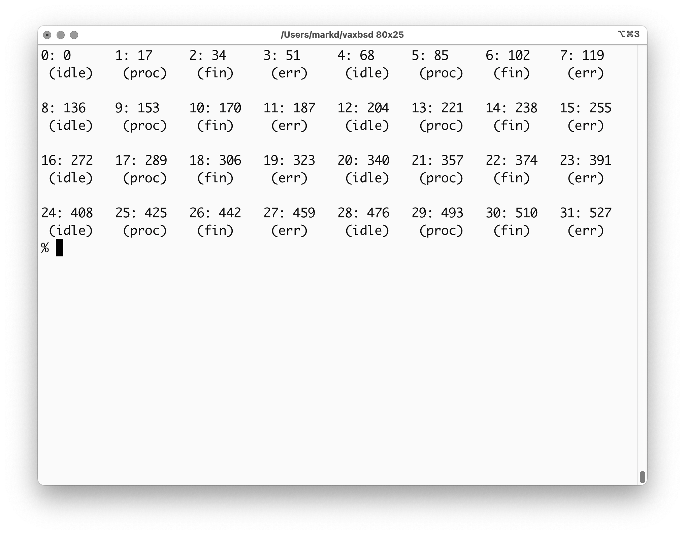
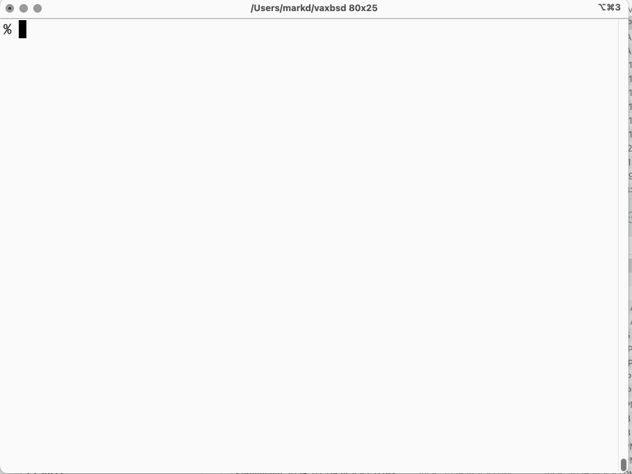

# iPSC

Intel Personal Super Computer stuffs.

The iPSC is made of towers of 32-node 286 and 287 processors.
Programming via C or FORTRAN in a XENIX host.

The LSSM has a working iPSC (it's a model d6 with 64 nodes in two
towers, but we only have 32 nodes working right now in one tower).

I want to write some demo code to have it run something interesting.
As part of that, I want a dashboard kind of thing where nodes can
report their status, so we can see computation flowing through the
"cube"

So far I've started sketching in stuff in KnR C inside of BSD 4.3 on
a simh VAX emulator.

Step 1 - getting a small grid of stuff drawing.  I decided not to use
curses: it's a chonker on a 286 system, plus the version available to
me doesn't support the DEC VT-100 graphics characters for forming the
box. I want something pretty rather than the `+------+` ASCII-styling.
So this talks VT-100/ANSI directly.

Step 2 - actually use the DEC graphics characters.  Plus change values
and update them

